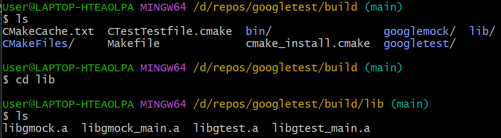
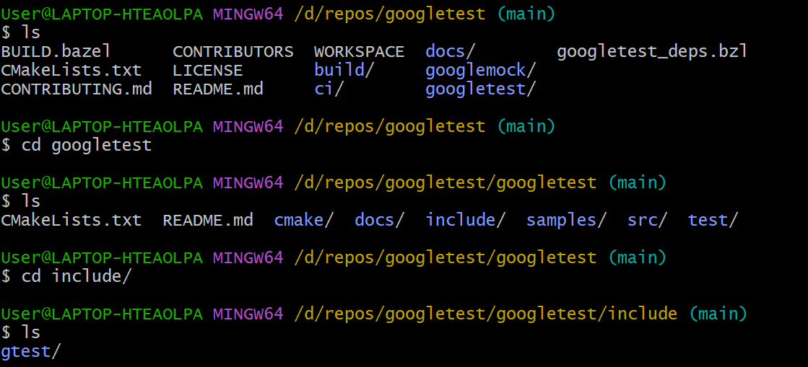
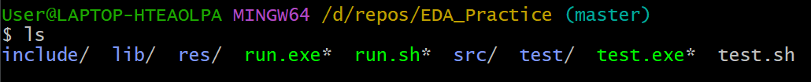

# EDA Practice
### GoogleTest (gtest)
#### Windows
    git clone git@github.com:google/googletest.git
    cd googletest
    mkdir build
    cd build
    cmake -G "MinGW Makefiles" ..
    mingw32-make.exe

Copy lib/ to your project.

Copy include/ to your project.

Result
